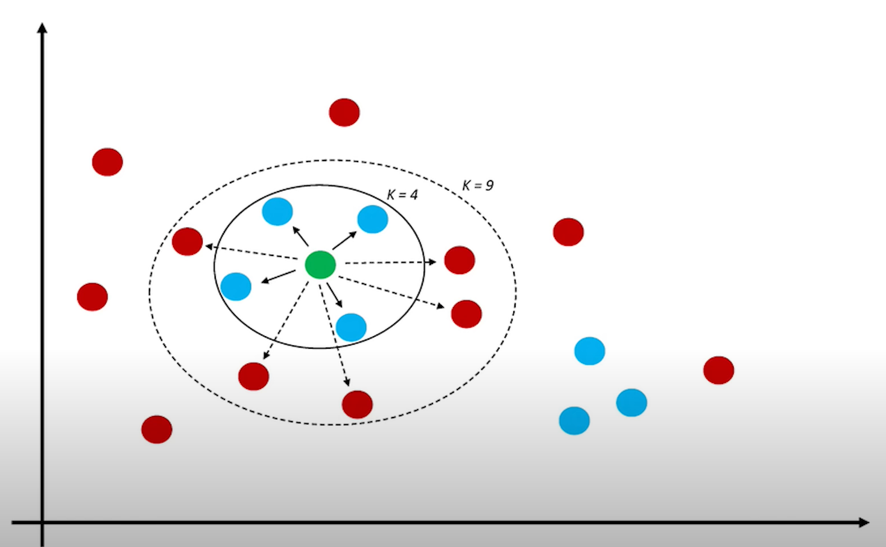

# **K-Nearest Neighbors (KNN)**

## Introduction

K-Nearest Neighbors (KNN) is one of the most widely used machine learning algorithms in the industry due to its **simplicity and effectiveness**. 

**Key characteristics:**
- **Non-parametric algorithm**: Makes no assumptions about the underlying data distribution
- **Instance-based learning**: Learns directly from the data
- **Supervised learning**: Can be used for both classification and regression
- **Lazy learning**: No training phase - stores the data and uses it directly for predictions

## How KNN Works

Given a training dataset, for each sample to be predicted, KNN:

1. **Calculates the distance** from the test point to all training points
2. **Finds the K nearest neighbors** (K closest training samples)
3. **For classification**: Assigns the most common label among the K neighbors
4. **For regression**: Assigns the average value of the K neighbors



In the image above:
- With **K=3**: The green point would be classified as "red triangle" (2 red triangles vs 1 blue square)
- With **K=5**: The green point would be classified as "blue square" (3 blue squares vs 2 red triangles)


```
import numpy as np
import pandas as pd
import matplotlib.pyplot as plt
from sklearn.neighbors import KNeighborsClassifier, KNeighborsRegressor
from sklearn.model_selection import train_test_split
from sklearn.datasets import make_classification, make_regression
```

## Lazy Learning Characteristics

KNN is a **lazy learning** (or **instance-based learning**) algorithm, which means it **learns by remembering, not by summarizing**. Unlike traditional "eager learning" algorithms that extract patterns and fix internal parameter values during training, **KNN stores the entire training dataset and uses it as a "knowledge base"** for making predictions. This can be a disadvantage, as **every time a prediction needs to be made, the entire dataset must be consulted, which requires significant memory and processing resources**.

Thus, the "training" phase is very lightweight since it consists only of storing the training data. However, prediction is computationally expensive, as the distance from each test point to all training points must be calculated. Therefore, **KNN is a slow algorithm and is not suitable for large datasets**.

## Simple Classification Example

Let's start with an extremely simple example to understand how KNN classification works.


```
# Create a very simple dataset: 6 points in 2D
# Features: [x, y] coordinates
X_train = np.array([
    [1, 1],   # Class 0 (Red)
    [1.5, 2], # Class 0 (Red)
    [2, 1],   # Class 0 (Red)
    [6, 6],   # Class 1 (Blue)
    [6.5, 5], # Class 1 (Blue)
    [7, 6]    # Class 1 (Blue)
])

# Labels: 0 = Red, 1 = Blue
y_train = np.array([0, 0, 0, 1, 1, 1])

# New point to classify
X_test = np.array([[5, 4]])

print("Training data:")
print("Class 0 (Red) points:", X_train[y_train == 0])
print("Class 1 (Blue) points:", X_train[y_train == 1])
print("\nTest point to classify:", X_test[0])
```


```
# Visualize the data
plt.figure(figsize=(8, 6))

# Plot training points
plt.scatter(X_train[y_train == 0, 0], X_train[y_train == 0, 1], 
           c='red', s=200, marker='o', edgecolors='k', linewidth=2, label='Class 0 (Red)', alpha=0.7)
plt.scatter(X_train[y_train == 1, 0], X_train[y_train == 1, 1], 
           c='blue', s=200, marker='s', edgecolors='k', linewidth=2, label='Class 1 (Blue)', alpha=0.7)

# Plot test point
plt.scatter(X_test[:, 0], X_test[:, 1], 
           c='green', s=300, marker='*', edgecolors='k', linewidth=2, label='Test point', zorder=5)

# Add labels to points
for i, (x, y) in enumerate(X_train):
    plt.annotate(f'P{i+1}', (x, y), xytext=(5, 5), textcoords='offset points', fontsize=10, fontweight='bold')

plt.xlabel('Feature 1 (x)', fontsize=12)
plt.ylabel('Feature 2 (y)', fontsize=12)
plt.title('Simple KNN Classification Example', fontsize=14, fontweight='bold')
plt.legend(fontsize=11)
plt.grid(True, alpha=0.3)
plt.show()
```

### Manually Calculate Distances

Let's manually calculate the distance from the test point to each training point using **Euclidean distance**:

$$d = \sqrt{(x_2 - x_1)^2 + (y_2 - y_1)^2}$$


```
# Calculate distances from test point to all training points
test_point = X_test[0]
distances = []

print(f"Test point: {test_point}\n")
print(f"{'Point':<8} {'Coordinates':<15} {'Class':<10} {'Distance Calculation':<40} {'Distance'}")
print("="*95)

for i, (point, label) in enumerate(zip(X_train, y_train)):
    dist = np.sqrt((point[0] - test_point[0])**2 + (point[1] - test_point[1])**2)
    distances.append(dist)
    calc_str = f"√[({point[0]}-{test_point[0]})² + ({point[1]}-{test_point[1]})²]"
    print(f"P{i+1:<7} {str(point):<15} {label:<10} {calc_str:<40} {dist:.3f}")

# Sort by distance
sorted_indices = np.argsort(distances)
print("\n" + "="*95)
print("Points sorted by distance:")
print("="*95)
for rank, idx in enumerate(sorted_indices, 1):
    print(f"{rank}. P{idx+1} (Class {y_train[idx]}) - Distance: {distances[idx]:.3f}")
```

### Apply KNN with Different K Values


```
# Try different K values
k_values = [1, 3, 5]

print("KNN Predictions with different K values:\n")
print("="*80)

for k in k_values:
    # Create and train KNN classifier
    knn = KNeighborsClassifier(n_neighbors=k)
    knn.fit(X_train, y_train)
    
    # Predict
    prediction = knn.predict(X_test)[0]
    probabilities = knn.predict_proba(X_test)[0]
    
    # Find the K nearest neighbors
    sorted_indices = np.argsort(distances)[:k]
    neighbor_classes = y_train[sorted_indices]
    
    print(f"\nK = {k}:")
    print(f"  Nearest neighbors: ", end="")
    for idx in sorted_indices:
        print(f"P{idx+1}(Class {y_train[idx]}, dist={distances[idx]:.3f})  ", end="")
    print(f"\n  Neighbor classes: {neighbor_classes}")
    print(f"  Vote count: Class 0: {np.sum(neighbor_classes == 0)}, Class 1: {np.sum(neighbor_classes == 1)}")
    print(f"  Predicted class: {prediction} ({'Red' if prediction == 0 else 'Blue'})")
    print(f"  Probabilities: Class 0: {probabilities[0]:.2%}, Class 1: {probabilities[1]:.2%}")

print("\n" + "="*80)
```

### Visualize K Nearest Neighbors


```
# Visualize with different K values
fig, axes = plt.subplots(1, 3, figsize=(18, 5))

for idx, k in enumerate([1, 3, 5]):
    ax = axes[idx]
    
    # Plot training points
    ax.scatter(X_train[y_train == 0, 0], X_train[y_train == 0, 1], 
              c='red', s=200, marker='o', edgecolors='k', linewidth=2, label='Class 0', alpha=0.7)
    ax.scatter(X_train[y_train == 1, 0], X_train[y_train == 1, 1], 
              c='blue', s=200, marker='s', edgecolors='k', linewidth=2, label='Class 1', alpha=0.7)
    
    # Plot test point
    ax.scatter(X_test[:, 0], X_test[:, 1], 
              c='green', s=300, marker='*', edgecolors='k', linewidth=2, label='Test point', zorder=5)
    
    # Draw circles to K nearest neighbors
    sorted_indices = np.argsort(distances)[:k]
    for neighbor_idx in sorted_indices:
        ax.plot([X_test[0, 0], X_train[neighbor_idx, 0]], 
               [X_test[0, 1], X_train[neighbor_idx, 1]], 
               'g--', linewidth=2, alpha=0.6)
    
    # Make prediction
    knn = KNeighborsClassifier(n_neighbors=k)
    knn.fit(X_train, y_train)
    prediction = knn.predict(X_test)[0]
    pred_color = 'Red' if prediction == 0 else 'Blue'
    
    ax.set_xlabel('Feature 1 (x)', fontsize=11)
    ax.set_ylabel('Feature 2 (y)', fontsize=11)
    ax.set_title(f'K = {k}\nPrediction: {pred_color}', fontsize=12, fontweight='bold')
    ax.legend(fontsize=9)
    ax.grid(True, alpha=0.3)

plt.tight_layout()
plt.show()
```

## Classification with a Larger Dataset

Let's see how KNN works with a more realistic dataset and visualize the decision boundaries.


```
# Generate a synthetic dataset
np.random.seed(42)
X, y = make_classification(n_samples=100, n_features=2, n_redundant=0, n_informative=2,
                          n_clusters_per_class=1, flip_y=0.1, random_state=42)

# Split into train and test
X_train_large, X_test_large, y_train_large, y_test_large = train_test_split(X, y, test_size=0.2, random_state=42)

print(f"Training set size: {len(X_train_large)}")
print(f"Test set size: {len(X_test_large)}")
print(f"\nClass distribution in training set:")
print(f"  Class 0: {np.sum(y_train_large == 0)} samples")
print(f"  Class 1: {np.sum(y_train_large == 1)} samples")
```


```
# Train models with different K values and compare
from sklearn.metrics import accuracy_score

k_values = [1, 3, 5, 10, 20]
accuracies = []

print("Model Performance with Different K Values:\n")
print(f"{'K':<5} {'Training Accuracy':<20} {'Test Accuracy'}")
print("="*50)

for k in k_values:
    knn = KNeighborsClassifier(n_neighbors=k)
    knn.fit(X_train_large, y_train_large)
    
    train_acc = accuracy_score(y_train_large, knn.predict(X_train_large))
    test_acc = accuracy_score(y_test_large, knn.predict(X_test_large))
    accuracies.append(test_acc)
    
    print(f"{k:<5} {train_acc:<20.2%} {test_acc:.2%}")

print("="*50)
best_k = k_values[np.argmax(accuracies)]
print(f"\nBest K value: {best_k} (Test accuracy: {max(accuracies):.2%})")
```


```
# Visualize decision boundaries for different K values
from matplotlib.colors import ListedColormap

def plot_decision_boundary(X, y, k, ax):
    """Plot decision boundary for KNN classifier"""
    knn = KNeighborsClassifier(n_neighbors=k)
    knn.fit(X, y)
    
    # Create mesh
    h = 0.02
    x_min, x_max = X[:, 0].min() - 1, X[:, 0].max() + 1
    y_min, y_max = X[:, 1].min() - 1, X[:, 1].max() + 1
    xx, yy = np.meshgrid(np.arange(x_min, x_max, h), np.arange(y_min, y_max, h))
    
    # Predict on mesh
    Z = knn.predict(np.c_[xx.ravel(), yy.ravel()])
    Z = Z.reshape(xx.shape)
    
    # Plot
    cmap_light = ListedColormap(['#FFAAAA', '#AAAAFF'])
    cmap_bold = ListedColormap(['#FF0000', '#0000FF'])
    
    ax.contourf(xx, yy, Z, alpha=0.3, cmap=cmap_light)
    ax.scatter(X[:, 0], X[:, 1], c=y, cmap=cmap_bold, edgecolor='k', s=50, alpha=0.8)
    ax.set_title(f'K = {k}', fontsize=12, fontweight='bold')
    ax.set_xlabel('Feature 1')
    ax.set_ylabel('Feature 2')

# Plot decision boundaries
fig, axes = plt.subplots(2, 3, figsize=(15, 10))
k_values_viz = [1, 3, 5, 10, 20, 50]

for idx, k in enumerate(k_values_viz):
    ax = axes[idx // 3, idx % 3]
    plot_decision_boundary(X_train_large, y_train_large, k, ax)

plt.suptitle('KNN Decision Boundaries with Different K Values', fontsize=14, fontweight='bold')
plt.tight_layout()
plt.show()

print("\nObservations:")
print("• K=1: Very complex boundary, prone to overfitting (fits training data too closely)")
print("• K=5-10: Smoother boundaries, better generalization")
print("• K=50: Too smooth, may underfit (misses important patterns)")
```

## The Critical Importance of Feature Scaling in KNN

One of the most important considerations when using KNN is **feature scaling**. Since KNN uses distance metrics (like Euclidean distance) to find nearest neighbors, features with larger scales will dominate the distance calculation, effectively **shadowing** features with smaller scales.

### Why Scaling Matters

Consider two features:
- **Feature 1**: Age (range: 0-100)
- **Feature 2**: Income (range: 0-100,000)

When calculating Euclidean distance, a difference of $10,000 in income will completely dominate a difference of 10 years in age, even though both differences might be equally important for classification.

Let's demonstrate this with a visual example.


```
# Generate synthetic data with two features of very different scales
np.random.seed(0)

# Class 0: centered around (5, 50)
X_class0_f1 = np.random.normal(5, 1.5, 15)    # Feature 1: small scale (0-10)
X_class0_f2 = np.random.normal(50, 15, 15)    # Feature 2: large scale (0-100)

# Class 1: centered around (8, 70)
X_class1_f1 = np.random.normal(8, 1.5, 15)    # Feature 1: small scale (0-10)
X_class1_f2 = np.random.normal(70, 15, 15)    # Feature 2: large scale (0-100)

# Combine the data
X_unscaled = np.column_stack([
    np.concatenate([X_class0_f1, X_class1_f1]),
    np.concatenate([X_class0_f2, X_class1_f2])
])
y = np.concatenate([np.zeros(15), np.ones(15)])

print(f"Feature 1 range: [{X_unscaled[:, 0].min():.2f}, {X_unscaled[:, 0].max():.2f}]")
print(f"Feature 2 range: [{X_unscaled[:, 1].min():.2f}, {X_unscaled[:, 1].max():.2f}]")
print(f"\nScale ratio: {(X_unscaled[:, 1].max() - X_unscaled[:, 1].min()) / (X_unscaled[:, 0].max() - X_unscaled[:, 0].min()):.1f}x")
```


```
from sklearn.preprocessing import StandardScaler

# Create a test point
test_point = np.array([[6.5, 60]])

# Train KNN on unscaled data
knn_unscaled = KNeighborsClassifier(n_neighbors=5)
knn_unscaled.fit(X_unscaled, y)

# Find neighbors for the test point
distances_unscaled, indices_unscaled = knn_unscaled.kneighbors(test_point)

# Scale the data
scaler = StandardScaler()
X_scaled = scaler.fit_transform(X_unscaled)
test_point_scaled = scaler.transform(test_point)

# Train KNN on scaled data
knn_scaled = KNeighborsClassifier(n_neighbors=5)
knn_scaled.fit(X_scaled, y)

# Find neighbors for the scaled test point
distances_scaled, indices_scaled = knn_scaled.kneighbors(test_point_scaled)

# Visualize the difference
fig, axes = plt.subplots(1, 2, figsize=(16, 6))

# Plot 1: Unscaled data
ax1 = axes[0]
ax1.scatter(X_unscaled[y==0, 0], X_unscaled[y==0, 1], 
           c='red', s=100, alpha=0.6, label='Class 0', edgecolors='k')
ax1.scatter(X_unscaled[y==1, 0], X_unscaled[y==1, 1], 
           c='blue', s=100, alpha=0.6, label='Class 1', edgecolors='k')
ax1.scatter(test_point[0, 0], test_point[0, 1], 
           c='green', s=300, marker='*', label='Test Point', 
           edgecolors='k', linewidths=2, zorder=5)

# Highlight neighbors in unscaled data
neighbors_unscaled = X_unscaled[indices_unscaled[0]]
ax1.scatter(neighbors_unscaled[:, 0], neighbors_unscaled[:, 1], 
           s=400, facecolors='none', edgecolors='orange', 
           linewidths=3, label='5 Nearest Neighbors')

# Draw lines to neighbors
for neighbor in neighbors_unscaled:
    ax1.plot([test_point[0, 0], neighbor[0]], 
            [test_point[0, 1], neighbor[1]], 
            'orange', linestyle='--', alpha=0.5, linewidth=1.5)

ax1.set_xlabel('Feature 1 (Small Scale: 0-10)', fontsize=12, fontweight='bold')
ax1.set_ylabel('Feature 2 (Large Scale: 0-100)', fontsize=12, fontweight='bold')
ax1.set_title('WITHOUT Scaling\n(Feature 2 dominates distance calculation)', 
             fontsize=13, fontweight='bold', color='red')
ax1.legend(fontsize=10)
ax1.grid(True, alpha=0.3)

# Add annotation showing the problem
prediction_unscaled = knn_unscaled.predict(test_point)[0]
ax1.text(0.02, 0.98, f'Prediction: Class {int(prediction_unscaled)}', 
        transform=ax1.transAxes, fontsize=11, fontweight='bold',
        verticalalignment='top', bbox=dict(boxstyle='round', 
        facecolor='wheat', alpha=0.8))

# Plot 2: Scaled data
ax2 = axes[1]
ax2.scatter(X_scaled[y==0, 0], X_scaled[y==0, 1], 
           c='red', s=100, alpha=0.6, label='Class 0', edgecolors='k')
ax2.scatter(X_scaled[y==1, 0], X_scaled[y==1, 1], 
           c='blue', s=100, alpha=0.6, label='Class 1', edgecolors='k')
ax2.scatter(test_point_scaled[0, 0], test_point_scaled[0, 1], 
           c='green', s=300, marker='*', label='Test Point', 
           edgecolors='k', linewidths=2, zorder=5)

# Highlight neighbors in scaled data
neighbors_scaled = X_scaled[indices_scaled[0]]
ax2.scatter(neighbors_scaled[:, 0], neighbors_scaled[:, 1], 
           s=400, facecolors='none', edgecolors='lime', 
           linewidths=3, label='5 Nearest Neighbors')

# Draw lines to neighbors
for neighbor in neighbors_scaled:
    ax2.plot([test_point_scaled[0, 0], neighbor[0]], 
            [test_point_scaled[0, 1], neighbor[1]], 
            'lime', linestyle='--', alpha=0.5, linewidth=1.5)

ax2.set_xlabel('Feature 1 (Standardized)', fontsize=12, fontweight='bold')
ax2.set_ylabel('Feature 2 (Standardized)', fontsize=12, fontweight='bold')
ax2.set_title('WITH Scaling (StandardScaler)\n(Both features contribute equally)', 
             fontsize=13, fontweight='bold', color='green')
ax2.legend(fontsize=10)
ax2.grid(True, alpha=0.3)

# Add annotation
prediction_scaled = knn_scaled.predict(test_point_scaled)[0]
ax2.text(0.02, 0.98, f'Prediction: Class {int(prediction_scaled)}', 
        transform=ax2.transAxes, fontsize=11, fontweight='bold',
        verticalalignment='top', bbox=dict(boxstyle='round', 
        facecolor='lightgreen', alpha=0.8))

plt.tight_layout()
plt.show()

print(f"\nPrediction WITHOUT scaling: Class {int(prediction_unscaled)}")
print(f"Prediction WITH scaling: Class {int(prediction_scaled)}")
print(f"\nThe predictions {'DIFFER' if prediction_unscaled != prediction_scaled else 'are the SAME'}!")
```

### Analysis of the Results

As you can see in the visualizations above:

**Without Scaling (Left Plot)**:
- Feature 2 has a much larger range (0-100) than Feature 1 (0-10)
- The distance calculation is dominated by Feature 2
- The nearest neighbors are selected primarily based on proximity in the vertical (Feature 2) direction
- Feature 1 is effectively **shadowed** and contributes very little to the decision

**With Scaling (Right Plot)**:
- Both features are standardized to have similar ranges
- The distance calculation considers both features equally
- The nearest neighbors are selected based on true proximity in both dimensions
- Both features contribute meaningfully to the classification decision

### Key Takeaways

1. **Always scale your features** when using KNN (or any distance-based algorithm)
2. Common scaling methods:
   - **StandardScaler**: Standardizes features to have mean=0 and variance=1
   - **MinMaxScaler**: Scales features to a fixed range (usually 0-1)
   - **RobustScaler**: Uses median and IQR, less sensitive to outliers
3. **Different predictions** can result from scaled vs. unscaled data
4. Scaling ensures **all features contribute fairly** to the distance calculation


```
# Let's see the actual distances to understand the shadowing effect
print("Distance Contributions for the First Neighbor:\n" + "="*60)

# Unscaled distances
first_neighbor_unscaled = X_unscaled[indices_unscaled[0][0]]
dist_f1_unscaled = abs(test_point[0, 0] - first_neighbor_unscaled[0])
dist_f2_unscaled = abs(test_point[0, 1] - first_neighbor_unscaled[1])
total_dist_unscaled = np.sqrt(dist_f1_unscaled**2 + dist_f2_unscaled**2)

print("\nWITHOUT scaling:")
print(f"  Feature 1 contribution: {dist_f1_unscaled:.3f}")
print(f"  Feature 2 contribution: {dist_f2_unscaled:.3f}")
print(f"  Total distance: {total_dist_unscaled:.3f}")
print(f"  Feature 2 dominance: {(dist_f2_unscaled/total_dist_unscaled)*100:.1f}% of total distance")

# Scaled distances
first_neighbor_scaled = X_scaled[indices_scaled[0][0]]
dist_f1_scaled = abs(test_point_scaled[0, 0] - first_neighbor_scaled[0])
dist_f2_scaled = abs(test_point_scaled[0, 1] - first_neighbor_scaled[1])
total_dist_scaled = np.sqrt(dist_f1_scaled**2 + dist_f2_scaled**2)

print("\nWITH scaling:")
print(f"  Feature 1 contribution: {dist_f1_scaled:.3f}")
print(f"  Feature 2 contribution: {dist_f2_scaled:.3f}")
print(f"  Total distance: {total_dist_scaled:.3f}")
print(f"  Features are balanced: ~{(max(dist_f1_scaled, dist_f2_scaled)/total_dist_scaled)*100:.1f}% vs ~{(min(dist_f1_scaled, dist_f2_scaled)/total_dist_scaled)*100:.1f}%")
```

## Simple Regression Example

In regression, KNN assigns the **average value** of the K nearest neighbors to the test point.


```
# Create a simple 1D regression example
X_reg_train = np.array([[1], [2], [3], [5], [6], [7]])
y_reg_train = np.array([2, 3, 3.5, 5, 5.5, 6])

# Point to predict
X_reg_test = np.array([[4]])

print("Training data:")
for x, y in zip(X_reg_train.ravel(), y_reg_train):
    print(f"  x = {x}, y = {y}")
print(f"\nPredict y for x = {X_reg_test[0, 0]}")
```


```
# Calculate distances and make predictions manually
test_x = X_reg_test[0, 0]
distances_reg = np.abs(X_reg_train.ravel() - test_x)

print(f"\nDistances from x = {test_x}:\n")
print(f"{'Training Point':<20} {'Distance':<15} {'y Value'}")
print("="*50)
for i, (x, dist, y) in enumerate(zip(X_reg_train.ravel(), distances_reg, y_reg_train)):
    print(f"x = {x:<17} {dist:<15.1f} {y}")

# Sort by distance
sorted_indices_reg = np.argsort(distances_reg)

print("\n" + "="*50)
print("Predictions with different K values:\n")

for k in [1, 2, 3]:
    # Get K nearest neighbors
    nearest_indices = sorted_indices_reg[:k]
    nearest_x = X_reg_train[nearest_indices].ravel()
    nearest_y = y_reg_train[nearest_indices]
    
    # Calculate prediction (average of K nearest neighbors)
    prediction_manual = np.mean(nearest_y)
    
    # Using sklearn
    knn_reg = KNeighborsRegressor(n_neighbors=k)
    knn_reg.fit(X_reg_train, y_reg_train)
    prediction_sklearn = knn_reg.predict(X_reg_test)[0]
    
    print(f"K = {k}:")
    print(f"  Nearest neighbors: x = {list(nearest_x)}, y = {list(nearest_y)}")
    print(f"  Prediction = average({list(nearest_y)}) = {prediction_manual:.2f}")
    print(f"  sklearn prediction: {prediction_sklearn:.2f}")
    print()
```


```
# Visualize regression with different K values
fig, axes = plt.subplots(1, 3, figsize=(18, 5))

# Create a range for smooth predictions
X_range = np.linspace(0.5, 7.5, 100).reshape(-1, 1)

for idx, k in enumerate([1, 2, 3]):
    ax = axes[idx]
    
    # Train model
    knn_reg = KNeighborsRegressor(n_neighbors=k)
    knn_reg.fit(X_reg_train, y_reg_train)
    
    # Predict on range
    y_pred_range = knn_reg.predict(X_range)
    
    # Plot training data
    ax.scatter(X_reg_train, y_reg_train, c='blue', s=150, edgecolors='k', 
              linewidth=2, label='Training data', zorder=3)
    
    # Plot prediction line
    ax.plot(X_range, y_pred_range, 'r-', linewidth=2, label='KNN prediction', alpha=0.8)
    
    # Highlight test point
    test_pred = knn_reg.predict(X_reg_test)[0]
    ax.scatter(X_reg_test, test_pred, c='green', s=300, marker='*', 
              edgecolors='k', linewidth=2, label=f'Test prediction (y={test_pred:.2f})', zorder=4)
    
    # Draw lines to nearest neighbors
    sorted_indices_reg = np.argsort(distances_reg)[:k]
    for neighbor_idx in sorted_indices_reg:
        ax.plot([X_reg_test[0, 0], X_reg_train[neighbor_idx, 0]], 
               [test_pred, y_reg_train[neighbor_idx]], 
               'g--', linewidth=1.5, alpha=0.5)
    
    ax.set_xlabel('x', fontsize=12)
    ax.set_ylabel('y', fontsize=12)
    ax.set_title(f'K = {k}', fontsize=13, fontweight='bold')
    ax.legend(fontsize=9)
    ax.grid(True, alpha=0.3)

plt.suptitle('KNN Regression with Different K Values', fontsize=14, fontweight='bold')
plt.tight_layout()
plt.show()
```

## Regression with a Real Dataset

Let's apply KNN regression to a more realistic scenario.


```
# Generate synthetic regression data
np.random.seed(42)
X_reg_large = np.sort(5 * np.random.rand(80, 1), axis=0)
y_reg_large = np.sin(X_reg_large).ravel() + np.random.normal(0, 0.1, X_reg_large.shape[0])

# Split data
X_reg_train_large = X_reg_large[:60]
y_reg_train_large = y_reg_large[:60]
X_reg_test_large = X_reg_large[60:]
y_reg_test_large = y_reg_large[60:]

print(f"Training set size: {len(X_reg_train_large)}")
print(f"Test set size: {len(X_reg_test_large)}")
```


```
# Compare different K values
from sklearn.metrics import mean_squared_error, r2_score

k_values_reg = [1, 3, 5, 10, 20]

print("Regression Performance with Different K Values:\n")
print(f"{'K':<5} {'Train MSE':<15} {'Test MSE':<15} {'Test R²'}")
print("="*55)

for k in k_values_reg:
    knn_reg = KNeighborsRegressor(n_neighbors=k)
    knn_reg.fit(X_reg_train_large, y_reg_train_large)
    
    train_pred = knn_reg.predict(X_reg_train_large)
    test_pred = knn_reg.predict(X_reg_test_large)
    
    train_mse = mean_squared_error(y_reg_train_large, train_pred)
    test_mse = mean_squared_error(y_reg_test_large, test_pred)
    test_r2 = r2_score(y_reg_test_large, test_pred)
    
    print(f"{k:<5} {train_mse:<15.4f} {test_mse:<15.4f} {test_r2:.4f}")

print("="*55)
```


```
# Visualize regression fits
fig, axes = plt.subplots(2, 3, figsize=(18, 10))
k_values_viz_reg = [1, 3, 5, 10, 20, 30]

X_plot = np.linspace(0, 5, 500).reshape(-1, 1)

for idx, k in enumerate(k_values_viz_reg):
    ax = axes[idx // 3, idx % 3]
    
    # Train model
    knn_reg = KNeighborsRegressor(n_neighbors=k)
    knn_reg.fit(X_reg_train_large, y_reg_train_large)
    
    # Predict
    y_plot = knn_reg.predict(X_plot)
    test_pred = knn_reg.predict(X_reg_test_large)
    test_mse = mean_squared_error(y_reg_test_large, test_pred)
    
    # Plot
    ax.scatter(X_reg_train_large, y_reg_train_large, c='blue', s=50, 
              edgecolors='k', alpha=0.6, label='Training data')
    ax.scatter(X_reg_test_large, y_reg_test_large, c='green', s=50, 
              edgecolors='k', alpha=0.6, label='Test data')
    ax.plot(X_plot, y_plot, 'r-', linewidth=2, label='KNN prediction')
    
    ax.set_xlabel('x', fontsize=11)
    ax.set_ylabel('y', fontsize=11)
    ax.set_title(f'K = {k}\nTest MSE = {test_mse:.4f}', fontsize=11, fontweight='bold')
    ax.legend(fontsize=8)
    ax.grid(True, alpha=0.3)

plt.suptitle('KNN Regression: Effect of K on Model Smoothness', fontsize=14, fontweight='bold')
plt.tight_layout()
plt.show()

print("\nObservations:")
print("• K=1: Very wiggly, follows training data too closely (overfitting)")
print("• K=5-10: Smooth curve that captures the pattern well")
print("• K=30: Too smooth, misses the sinusoidal pattern (underfitting)")
```

## Distance Metrics

KNN uses distance to find neighbors. The most common distance metrics are:

1. **Euclidean distance** (default): $d = \sqrt{\sum_{i=1}^{n}(x_i - y_i)^2}$
2. **Manhattan distance**: $d = \sum_{i=1}^{n}|x_i - y_i|$
3. **Minkowski distance**: $d = (\sum_{i=1}^{n}|x_i - y_i|^p)^{1/p}$ (generalizes Euclidean and Manhattan)


```
# Compare different distance metrics
from sklearn.metrics import accuracy_score

metrics = ['euclidean', 'manhattan', 'minkowski']
k = 5

print(f"Comparing Distance Metrics (K = {k}):\n")
print(f"{'Metric':<15} {'Train Accuracy':<20} {'Test Accuracy'}")
print("="*55)

for metric in metrics:
    knn = KNeighborsClassifier(n_neighbors=k, metric=metric)
    knn.fit(X_train_large, y_train_large)
    
    train_acc = accuracy_score(y_train_large, knn.predict(X_train_large))
    test_acc = accuracy_score(y_test_large, knn.predict(X_test_large))
    
    print(f"{metric:<15} {train_acc:<20.2%} {test_acc:.2%}")

print("="*55)
print("\nNote: Different metrics may perform better on different datasets.")
print("Euclidean is most common for continuous features.")
```

## Key Characteristics of KNN

### Advantages:
- ✅ **Simple to understand and implement**
- ✅ **No training phase** (stores data directly)
- ✅ **Works well with small datasets**
- ✅ **No assumptions about data distribution** (non-parametric)
- ✅ **Can be used for both classification and regression**

### Disadvantages:
- ❌ **Slow prediction** (must calculate distance to all training points)
- ❌ **Memory intensive** (stores entire dataset)
- ❌ **Not suitable for large datasets** (curse of dimensionality)
- ❌ **Sensitive to feature scaling** (features with large ranges dominate distance calculation)
- ❌ **Sensitive to irrelevant features**
- ❌ **Choice of K is critical**

### Computational Complexity:
- **Training:** O(1) - just stores the data
- **Prediction:** O(n × d) - where n = number of training samples, d = number of features

This is opposite to most ML algorithms where training is expensive but prediction is fast!


## Choosing the Right K Value

**Guidelines for selecting K:**

1. **K = 1**: Very flexible, high variance, prone to overfitting
2. **K = √n** (where n is the number of training samples): Common rule of thumb
3. **K = large**: Very smooth, high bias, prone to underfitting
4. **Use cross-validation** to find the optimal K for your dataset
5. **Odd K for binary classification** to avoid ties

**Trade-off:**
- Small K → more complex model → overfitting
- Large K → simpler model → underfitting


```
# Find optimal K using cross-validation
from sklearn.model_selection import cross_val_score

k_range = range(1, 31)
k_scores = []

for k in k_range:
    knn = KNeighborsClassifier(n_neighbors=k)
    scores = cross_val_score(knn, X_train_large, y_train_large, cv=5, scoring='accuracy')
    k_scores.append(scores.mean())

# Plot results
plt.figure(figsize=(12, 6))
plt.plot(k_range, k_scores, 'b-o', linewidth=2, markersize=8)
plt.xlabel('K Value', fontsize=12)
plt.ylabel('Cross-Validation Accuracy', fontsize=12)
plt.title('Finding Optimal K using Cross-Validation', fontsize=14, fontweight='bold')
plt.grid(True, alpha=0.3)

# Mark the best K
best_k_cv = k_range[np.argmax(k_scores)]
plt.axvline(x=best_k_cv, color='r', linestyle='--', linewidth=2, label=f'Optimal K = {best_k_cv}')
plt.legend(fontsize=11)
plt.show()

print(f"Optimal K value: {best_k_cv}")
print(f"Cross-validation accuracy: {max(k_scores):.2%}")
```

## Summary

KNN is a **simple yet powerful algorithm** that:
- Makes predictions based on the K nearest training examples
- Uses **majority vote** for classification
- Uses **average** for regression
- Has no training phase (lazy learning)
- Is sensitive to the choice of K and distance metric
- Works best with small to medium-sized datasets
- Requires feature scaling for best results

**When to use KNN:**
- Small to medium datasets
- When you need a simple baseline model
- When the decision boundary is very irregular
- When you have low-dimensional data (few features)

**When NOT to use KNN:**
- Large datasets (slow prediction)
- High-dimensional data (curse of dimensionality)
- Real-time prediction requirements
- When memory is limited
