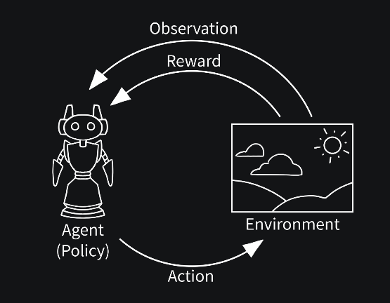

# Reinforcement Learning (Q-Learning)


## What is Reinforcement Learning?

Reinforcement learning is like teaching through trial and error - an agent learns by trying actions, receiving feedback (rewards), and gradually improving its behavior. Think of training a pet with treats, learning to ride a bike through practice, or mastering a video game by playing it repeatedly.


At its core, RL is about teaching an **Agent** (our algorithm) how to behave in an **Environment** (our game or problem) to maximize a **Reward**.

It's based on a simple loop:
1.  The **Agent** observes the **State** (S) of the environment.
2.  The **Agent** chooses an **Action** (A).
3.  The **Environment** reacts: it gives the agent a **Reward** (R) and a new **State** (S').
4.  The Agent learns from this (S, A, R, S') tuple and the loop repeats.

Our goal is to create an agent that, from any state, learns to pick the action that will give it the most *cumulative future reward*.


[](https://gymnasium.farama.org/introduction/basic_usage/)


## Understanding Q-Learning Intuitively

Q-learning builds a giant “cheat sheet” called a Q-table that tells the agent how good each action is in each situation:
- Rows = different situations (states) the agent can encounter
- Columns = different actions the agent can take
- Values = how good that action is in that situation (expected future reward)

### The Learning Process

1. Try an action and see what happens (reward + new state)
2. Update your cheat sheet: “That action was better/worse than I thought”
3. Gradually improve by trying actions and updating estimates
4. Balance exploration vs exploitation: Try new things vs use what you know works

Why it works: Over time, good actions get higher Q-values, bad actions get lower Q-values. The agent learns to pick actions with the highest expected rewards.


```
import numpy as np
import random
import time
from IPython.display import clear_output
```

### Environment

We'll create a simple 4x4 Grid World.

* **Agent (A):** Our learner.
* **Goal (G):** A good state with a +10 reward.
* **Trap (T):** A bad state with a -10 reward.
* **States (S):** Any grid position, represented as `(row, col)`.
* **Actions (A):** Up, Down, Left, Right.
* **Rewards (R):**
    * -0.1 for every step (to encourage speed).
    * +10 for reaching the Goal.
    * -10 for falling in the Trap.

Here's our map:
```
  (0,0) (0,1) (0,2) (0,3)
  (1,0) (1,1) (1,2) (1,3)
  (2,0) (2,1) [T]   (2,3)
  (3,0) (3,1) (3,2) [G]
```


```
# Environment parameters
GRID_ROWS = 4
GRID_COLS = 4
START_STATE = (0, 0)
GOAL_STATE = (3, 3)
TRAP_STATE = (2, 2)

# Rewards
REWARD_STEP = -0.1
REWARD_GOAL = 10
REWARD_TRAP = -10

# Actions (0: Up, 1: Down, 2: Left, 3: Right)
# We use indices for easier lookup in our Q-table
ACTIONS = [0, 1, 2, 3]
ACTION_NAMES = ["↑", "↓", "←", "→"]

# A dictionary to map action indices to (row_change, col_change)
# This is how we'll move on the grid
ACTION_VECTORS = {
    0: (-1, 0), # Up
    1: (1, 0),  # Down
    2: (0, -1), # Left
    3: (0, 1)   # Right
}

print(f"Grid World: {GRID_ROWS}x{GRID_COLS}")
print(f"Start: {START_STATE}, Goal: {GOAL_STATE}, Trap: {TRAP_STATE}")
print(f"Actions: {list(zip(ACTIONS, ACTION_NAMES))}")
```

    Grid World: 4x4
    Start: (0, 0), Goal: (3, 3), Trap: (2, 2)
    Actions: [(0, '↑'), (1, '↓'), (2, '←'), (3, '→')]


### The Agent's Brain (The Q-Table)

How will our agent "learn"? It will store its knowledge in a **Q-Table**.

* It's a big table (a 3D NumPy array in our case) where:
    * The rows represent the grid's **rows**.
    * The columns represent the grid's **columns**.
    * The 3rd dimension represents the **action**.

* `Q_table[row, col, action]` will store a number, the "Q-value".
* This **Q-value** is the agent's *prediction* of the total future reward it will get if it takes that `action` from that `(row, col)` state.

We initialize this table to all zeros, because our agent starts out knowing nothing.


```
Q_table = np.zeros((GRID_ROWS, GRID_COLS, len(ACTIONS)))

print("Initial Q-Table (all zeros):")
print(Q_table)
print(f"Shape of Q-Table: {Q_table.shape}")
```

    Initial Q-Table (all zeros):
    [[[0. 0. 0. 0.]
      [0. 0. 0. 0.]
      [0. 0. 0. 0.]
      [0. 0. 0. 0.]]
    
     [[0. 0. 0. 0.]
      [0. 0. 0. 0.]
      [0. 0. 0. 0.]
      [0. 0. 0. 0.]]
    
     [[0. 0. 0. 0.]
      [0. 0. 0. 0.]
      [0. 0. 0. 0.]
      [0. 0. 0. 0.]]
    
     [[0. 0. 0. 0.]
      [0. 0. 0. 0.]
      [0. 0. 0. 0.]
      [0. 0. 0. 0.]]]
    Shape of Q-Table: (4, 4, 4)


### The Learning Algorithm (Q-Learning)

This is the most important concept. How do we update the Q-table?

When the agent takes an **action** ($a$) from a **state** ($s$) and moves to a **new state** ($s'$) and gets a **reward** ($r$), we update the table using the **Bellman Equation**:

$$Q(s, a) \leftarrow Q(s, a) + \alpha \left[ r + \gamma \max_{a'} Q(s', a') - Q(s, a) \right]$$

Let's break this down in plain English:

* $Q(s, a) \leftarrow ...$
    * "Update the Q-value for the old state and action..."
* $... + \alpha [...]$ 
    * "...by adding a small portion (the **learning rate**, $\alpha$) of new information."
* $... [r + \gamma \max_{a'} Q(s', a') ...]$
    * This is the "new information." It's the **reward ($r$) we just got**...
    * ...plus the **best possible Q-value we can get from our new state ($s'$)**, (multiplied by a **discount factor**, $\gamma$, which values immediate rewards over future ones).
* $... - Q(s, a)]$
    * The full term in the brackets `[ ... ]` is the "temporal difference error": the difference between our *new guess* ($r + \gamma \max...$) and our *old guess* ($Q(s, a)$).

We also need a **strategy** for picking actions. We'll use **Epsilon-Greedy ($\epsilon$-greedy)**:

* With probability `1 - epsilon`: **Exploitation** (pick the best known action from the Q-table).
* With probability `epsilon`: **Exploration** (pick a random action to discover new paths).

This ensures our agent doesn't just get stuck in the first "good" path it finds.


```
# Hyperparameters
learning_rate = 0.1   # Alpha (α): How quickly the agent learns.
discount_factor = 0.9 # Gamma (γ): How much the agent values future rewards.
epsilon = 1.0         # Initial exploration rate
max_epsilon = 1.0     # Maximum exploration
min_epsilon = 0.01    # Minimum exploration
epsilon_decay = 0.001 # Rate at which exploration decreases

# Training parameters
total_episodes = 10000 # How many "games" to play
max_steps = 100        # Max steps per game (to prevent infinite loops)
```

    Hyperparameters set.


### Helper Functions

We need a few functions to run our simulation.

1.  `choose_action(state)`: Implements the $\epsilon$-greedy strategy.
2.  `take_action(state, action_index)`: Simulates taking an action and returns the `(new_state, reward, done)` tuple. This function will also handle "bumping into walls" (staying in the same state).


```
def choose_action(state, current_epsilon):
    """
    Chooses an action using the Epsilon-Greedy strategy.
    """
    row, col = state
    
    # Epsilon-Greedy decision
    if random.uniform(0, 1) < current_epsilon:
        # Explore: pick a random action
        return random.choice(ACTIONS)
    else:
        # Exploit: pick the best action from the Q-table
        # np.argmax finds the index (0, 1, 2, or 3) of the highest Q-value
        return np.argmax(Q_table[row, col])

def take_action(state, action_index):
    """
    Takes an action, calculates the new state, reward, and if the episode is done.
    """
    current_row, current_col = state
    action_row, action_col = ACTION_VECTORS[action_index]
    
    # Calculate new potential position
    new_row = current_row + action_row
    new_col = current_col + action_col
    
    # --- Check for wall collisions ---
    # Clamp the row to be within [0, GRID_ROWS - 1]
    new_row = max(0, min(new_row, GRID_ROWS - 1))
    # Clamp the col to be within [0, GRID_COLS - 1]
    new_col = max(0, min(new_col, GRID_COLS - 1))
    
    new_state = (new_row, new_col)
    
    # --- Get reward and check if done ---
    if new_state == GOAL_STATE:
        reward = REWARD_GOAL
        done = True
    elif new_state == TRAP_STATE:
        reward = REWARD_TRAP
        done = True
    else:
        reward = REWARD_STEP
        done = False
        
    return new_state, reward, done
```

    Helper functions defined.


### The Training Loop

This is where it all comes together! We will simulate many "episodes" (games). In each episode, the agent moves step-by-step until it reaches the Goal or the Trap.

At *every single step*, we will:
1.  Choose an action.
2.  Take the action and get the `(new_state, reward, done)` result.
3.  **Update our Q-table** using the Bellman equation.
4.  Move to the new state.

We will also "decay" epsilon over time, so the agent explores a lot at the beginning and then starts exploiting its knowledge more as it learns.


```
# To store rewards for plotting later
episode_rewards = []
current_epsilon = epsilon

for episode in range(total_episodes):
    state = START_STATE
    total_reward = 0
    
    for step in range(max_steps):
        # 1. Choose an action
        action_index = choose_action(state, current_epsilon)
        
        # 2. Take the action
        new_state, reward, done = take_action(state, action_index)
        
        # 3. Update the Q-table (The Q-Learning formula)
        row, col = state
        new_row, new_col = new_state
        
        old_q_value = Q_table[row, col, action_index]
        
        # This is max(Q(s', a')) from the formula
        best_future_q = np.max(Q_table[new_row, new_col])
        
        # The core Q-Learning update rule
        new_q_value = old_q_value + learning_rate * (reward + discount_factor * best_future_q - old_q_value)
        Q_table[row, col, action_index] = new_q_value
        
        # 4. Update state and reward
        state = new_state
        total_reward += reward
        
        if done:
            break # Episode finished
            
    # After the episode, store rewards and decay epsilon
    episode_rewards.append(total_reward)
    
    # Decay epsilon
    current_epsilon = min_epsilon + (max_epsilon - min_epsilon) * np.exp(-epsilon_decay * episode)
    
    if (episode + 1) % 1000 == 0:
        print(f"Episode {episode + 1}/{total_episodes} | Epsilon: {current_epsilon:.4f}")
```

    Starting training...
    Episode 1000/10000 | Epsilon: 0.3746
    Episode 2000/10000 | Epsilon: 0.1441
    Episode 3000/10000 | Epsilon: 0.0593
    Episode 4000/10000 | Epsilon: 0.0282
    Episode 5000/10000 | Epsilon: 0.0167
    Episode 6000/10000 | Epsilon: 0.0125
    Episode 7000/10000 | Epsilon: 0.0109
    Episode 8000/10000 | Epsilon: 0.0103
    Episode 9000/10000 | Epsilon: 0.0101
    Episode 10000/10000 | Epsilon: 0.0100
    Training finished!


### Results


```
print("Final Q-Table:\n", Q_table)
```

    Final Q-Table:
     [[[  4.845851     5.49539      4.845851     5.49539   ]
      [  5.49031183   6.2171       4.84450843   6.21077327]
      [  5.89263163   7.01868123   5.14562941   6.78771638]
      [  6.59440562   7.90652295   5.73506318   6.62690522]]
    
     [[  4.845851     6.2171       5.49539      6.2171    ]
      [  5.49539      7.019        5.49539      7.019     ]
      [  6.18609311  -9.99996013   6.21225183   7.91      ]
      [  6.98535067   8.9          6.97935395   7.90147564]]
    
     [[  5.49321698   7.019        6.21533051   7.01618581]
      [  6.2171       7.91         6.2171     -10.        ]
      [  0.           0.           0.           0.        ]
      [  7.79401761  10.          -9.9820299    8.88755425]]
    
     [[  6.21474144   7.01750571   7.01834937   7.91      ]
      [  7.019        7.91         7.019        8.9       ]
      [-10.           8.89999999   7.91        10.        ]
      [  0.           0.           0.           0.        ]]]


We can interpret easily the content of the final Q-table as a **Policy**. For each grid cell, we'll look at its Q-values and find the **action with the highest Q-value**. We'll print an arrow (`↑`, `↓`, `←`, `→`) for that action. This shows us the *optimal path* the agent learned from *any* square!


```
# In[8]:
print("🎓 Learned Policy (Best action from each state):")

# Create a grid to store our policy arrows
policy_grid = [["" for _ in range(GRID_COLS)] for _ in range(GRID_ROWS)]

for r in range(GRID_ROWS):
    for c in range(GRID_COLS):
        state = (r, c)
        
        if state == GOAL_STATE:
            policy_grid[r][c] = "🏆" # Goal
        elif state == TRAP_STATE:
            policy_grid[r][c] = "🔥" # Trap
        else:
            # Find the best action (index) from this state
            best_action_index = np.argmax(Q_table[r, c])
            # Map that index to its arrow
            policy_grid[r][c] = ACTION_NAMES[best_action_index]

# Print the policy grid
for row in policy_grid:
    # .join(row) combines all elements in the list into a string
    # We use \t (a tab) to space them out nicely
    print("\t".join(row))
```

    🎓 Learned Policy (Best action from each state):
    ↓	↓	↓	↓
    →	↓	→	↓
    ↓	↓	🔥	↓
    →	→	→	🏆


**If the training was successful, you should see a "field" of arrows all pointing towards the Goal (🏆) and steering clear of the Trap (🔥).**

---

### 🎬 Watch the Agent Play

Now let's use our learned policy (the Q-table) to play one game *without any exploration* (`epsilon = 0`). We'll see the optimal path it learned.


```
state = START_STATE
total_reward = 0
step_count = 0

for _ in range(max_steps):
    # Print the current grid
    clear_output(wait=True) # Clears the output for a nice animation
    
    # Create a temporary grid to print
    print_grid = [["." for _ in range(GRID_COLS)] for _ in range(GRID_ROWS)]
    print_grid[GOAL_STATE[0]][GOAL_STATE[1]] = "🏆"
    print_grid[TRAP_STATE[0]][TRAP_STATE[1]] = "🔥"
    print_grid[state[0]][state[1]] = "🤖" # Agent's current position
    
    print(f"Step: {step_count} | Total Reward: {total_reward:.1f}")
    for row in print_grid:
        print("\t".join(row))

    # --- Take the BEST action (no exploration) ---
    row, col = state
    action_index = np.argmax(Q_table[row, col])
    
    new_state, reward, done = take_action(state, action_index)
    
    state = new_state
    total_reward += reward
    step_count += 1
    
    time.sleep(0.5) # Pause for 0.5 seconds to see the move
    
    if done:
        # Print the final state
        clear_output(wait=True)
        print_grid = [["." for _ in range(GRID_COLS)] for _ in range(GRID_ROWS)]
        print_grid[GOAL_STATE[0]][GOAL_STATE[1]] = "🏆"
        print_grid[TRAP_STATE[0]][TRAP_STATE[1]] = "🔥"
        print_grid[state[0]][state[1]] = "🤖"
        
        print(f"Step: {step_count} | Total Reward: {total_reward:.1f}")
        for row in print_grid:
            print("\t".join(row))
        
        if state == GOAL_STATE:
            print("\n🎉 Agent reached the goal! 🎉")
        else:
            print("\n☠️ Agent fell in the trap! ☠️")
        break
```

    Step: 6 | Total Reward: 9.5
    .	.	.	.
    .	.	.	.
    .	.	🔥	.
    .	.	.	🤖
    
    🎉 Agent reached the goal! 🎉

