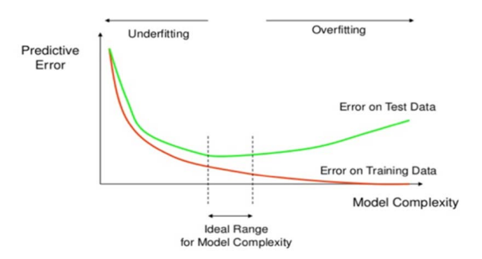
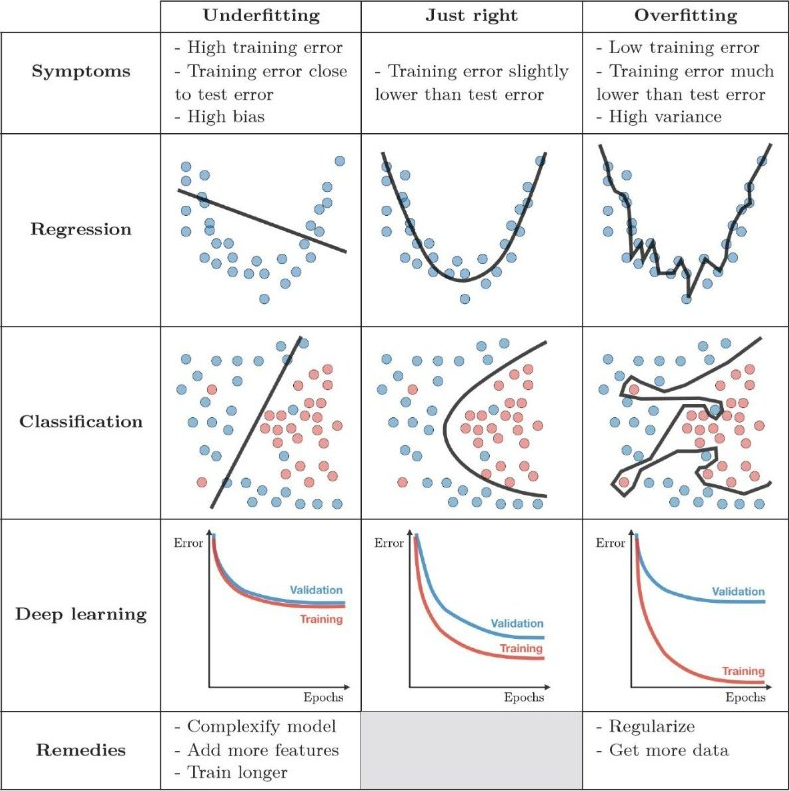

# Overfitting and Train-Test Split

## Environment Setup


```
import numpy as np
import pandas as pd
import matplotlib.pyplot as plt
```


```
def plot_regression(X, y, X_test=None, y_test=None, model=None):
    plt.scatter(X, y, color='blue', label='Train')
    if X_test is not None:
        plt.scatter(X_test, y_test, color='orange', label='Test')
    X_plot = pd.DataFrame(np.linspace(X.min(), X.max(), num=100), columns=X.columns)
    if model is not None:
        plt.plot(X_plot, model.predict(X_plot), color='red', label='Model')
    plt.xlabel("Years of Experience")
    plt.ylabel("Salary")
    if X_test is not None or model is not None:
        plt.legend()
    plt.show()
```

## Problem Definition and Data Preparation

Revisiting the examples from the simple linear regression and decision tree notebooks, we'll focus on the concept of **overfitting**, emphasizing the importance of splitting data into training and test sets.

Typically, a portion of the data is separated for use as a **test set**, while the model is trained on the rest (**train set**). This prevents **overfitting**, which occurs when the model fits the training data too closely and fails to generalize well to new data. If the error on the training set is low but high on the test set, the model is overfitted.

It's common to use 20% of the data for the test set, though this depends on the dataset size. The larger the dataset, the less data we need for the test set.

We'll use the salary prediction dataset based on years of work experience.


```
df = pd.read_csv("data/salaries2.csv")

X = df[['YearsExperience']]
y = df['Salary']

plot_regression(X, y)
```

and define Mean Absolute Error (MAE) as the performance metric.


```
from sklearn.metrics import mean_absolute_error
```

We split the data into two sets: training and test. **We train the models with the training data and evaluate their performance on the test set**.

The `random_state=42` parameter ensures reproducibility—running the code multiple times will produce the same split.


```
from sklearn.model_selection import train_test_split
X_train, X_test, y_train, y_test = train_test_split(X, y, test_size=0.2, random_state=42)
```

## Linear Regression

We train a linear regression model with the training data.


```
from sklearn.linear_model import LinearRegression
model_linear = LinearRegression().fit(X_train, y_train)
```

We can see the graphical representation of the linear regression in red, calculated with the training data (blue samples) and the test data in orange (which is used to evaluate model performance).


```
plot_regression(X_train, y_train, X_test, y_test, model_linear)
```

and calculate the model's performance **on the test set**: how much the model's predictions (trained on the training set) deviate from the actual values.


```
y_test_pred = model_linear.predict(X_test)
mae_linear = mean_absolute_error(y_test, y_test_pred)
print("MAE Linear Regression: ", mae_linear)
```

We see that the linear regression model's predictions deviate by an average of $14,907 annually from the actual salaries.

If we had calculated the deviation with the training set (though this is generally an error), the error wouldn't be much different in this case.


```
mae_linear_train = mean_absolute_error(y_train, model_linear.predict(X_train))
print("MAE Linear Regression (train): ", mae_linear_train)
```

## Regression Tree

Now we train a regression tree with the training data without limiting the tree's depth.


```
from sklearn.tree import DecisionTreeRegressor
tree_reg = DecisionTreeRegressor().fit(X_train, y_train)
```

By visualizing the model, the ***overfitting*** becomes quite clear.


```
plot_regression(X_train, y_train, X_test, y_test, tree_reg)
```

The overfitting is evident: the model fits the training data perfectly but doesn't generalize well to the test data. In this case, it's visually apparent, but it's also demonstrated by the large difference between training and test error. **This clearly shows why a test set must be separated to evaluate model performance**.

Models generally always fit training data better than test data. This is trivial since the model was trained on that data. But what matters is that the model generalizes well to unseen data, and that's what the test set evaluates.

It's evident how a decision tree tends toward overfitting while a linear model doesn't. This is a general tendency of **non-parametric** models versus **parametric** models:

- **Parametric models** (like linear regression) have a fixed structure with a predetermined number of parameters. They assume a specific functional form (e.g., a straight line) and cannot fit the data as closely.
- **Non-parametric models** (like decision trees) don't assume a fixed structure and can adapt their complexity to the data, making them more flexible but also more prone to overfitting.

For example, a linear model will always be a straight line (or a plane, or hyperplane, depending on data dimensionality), while a decision tree can be as complex as desired. Therefore, **non-parametric models tend to overfit more**.


```
print("MAE Decision Tree: ", mean_absolute_error(y_test, tree_reg.predict(X_test)))
print("MAE Decision Tree (train): ", mean_absolute_error(y_train, tree_reg.predict(X_train)))
```

By limiting the tree's depth, we can reduce overfitting.


```
tree_reg = DecisionTreeRegressor(max_depth=3).fit(X_train, y_train)
plot_regression(X_train, y_train, X_test, y_test, tree_reg)
print("MAE Decision Tree: ", mean_absolute_error(y_test, tree_reg.predict(X_test)))
print("MAE Decision Tree (train): ", mean_absolute_error(y_train, tree_reg.predict(X_train)))
```

The choice of depth in this case was made by testing different values and seeing which performs best on the test set (it improves up to depth 3, but at depth 4 it starts overfitting). There are more systematic methods for this—such as **cross-validation** and **hyperparameter tuning**—that we'll explore later.


```
plt.figure(figsize=(14, 8))

# Plot training and test data
plt.scatter(X, y, color='blue', label='Train')
plt.scatter(X_test, y_test, color='orange', label='Test') 

# Create smooth line for predictions
X_plot = pd.DataFrame(np.linspace(X.min(), X.max(), num=100), columns=X.columns)

# Train models with different depths
tree_reg2 = DecisionTreeRegressor(max_depth=2).fit(X_train, y_train)
mae2 = round(mean_absolute_error(y_test, tree_reg2.predict(X_test)), 0)
tree_reg3 = DecisionTreeRegressor(max_depth=3).fit(X_train, y_train)
mae3 = round(mean_absolute_error(y_test, tree_reg3.predict(X_test)), 0)
tree_reg4 = DecisionTreeRegressor(max_depth=4).fit(X_train, y_train)
mae4 = round(mean_absolute_error(y_test, tree_reg4.predict(X_test)), 0)

# Plot predictions for each depth
plt.plot(X_plot, tree_reg2.predict(X_plot), color='seagreen', label=f'MAE depth=2: {mae2}', linestyle=':')
plt.plot(X_plot, tree_reg3.predict(X_plot), color='red', label=f'MAE depth=3: {mae3} (lowest)', linewidth=2)
plt.plot(X_plot, tree_reg4.predict(X_plot), color='green', label=f'MAE depth=4: {mae4}', linestyle='-.')

# Annotate overfitting point
plt.annotate('Overfitting when increasing depth to 4', xy=(3.55, 128875.56), xytext=(4, 142000), 
             arrowprops=dict(facecolor='green', shrink=0.05))

plt.xlabel("Years of Experience")
plt.ylabel("Salary")
plt.legend()
plt.show()
```

## Underfitting and Overfitting

The concept of ***underfitting*** describes a model that is too simple to fit the training data well. It's the opposite of ***overfitting*** and occurs when the model cannot capture the complexity of the data.

- **Underfitting**: The model is too simple and has high error on both training and test sets (high bias).
- **Overfitting**: The model is too complex and has low error on training data but high error on test data (high variance).
- **Good fit**: The model captures the underlying patterns and generalizes well to unseen data.

[](https://ieeexplore.ieee.org/document/8405448)
[](https://github.com/gratus907/gratus907.github.io/blob/master/images/81b7294441f2b9c96cce938661b95a1d20d22366e5c0f72e48d2c69c9c7ad7b4.png)

## Supplementary Material

- [Dot CSV - Do Neural Networks... Learn or Memorize? - Overfitting and Underfitting - Part 1](https://www.youtube.com/watch?v=7-6X3DTt3R8)
