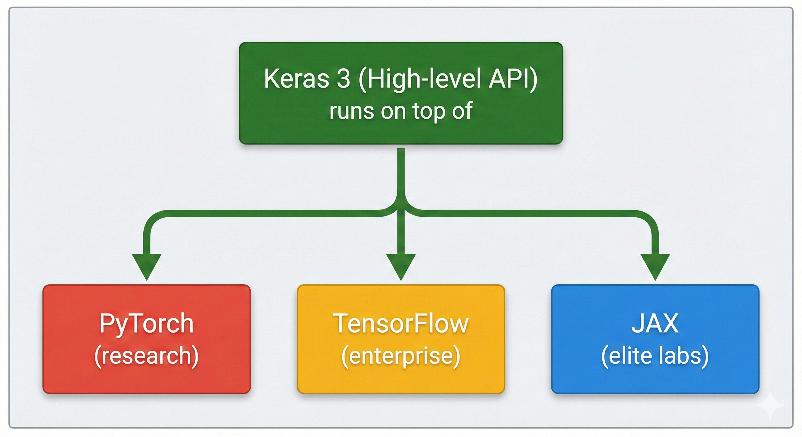
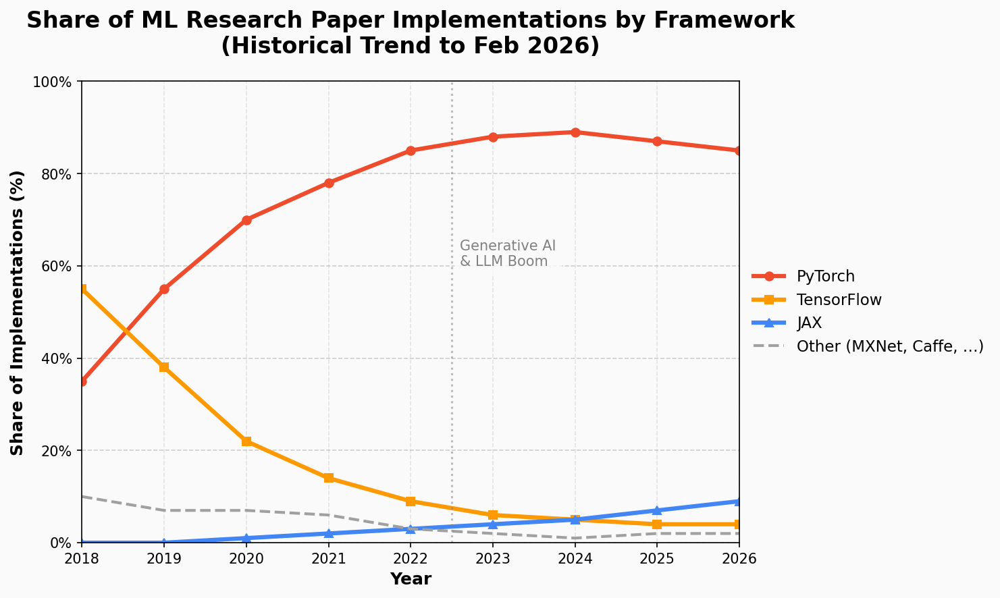
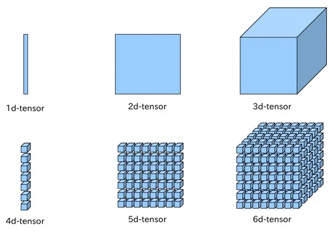

# PyTorch basics

## The modern deep learning ecosystem

To understand the current ML landscape, it helps to see the major frameworks as **specialized tools** for different stages of development.

### The two pillars: PyTorch and TensorFlow

| | **PyTorch** (Meta) | **TensorFlow** (Google) |
|---|---|---|
| **Strength** | Research & Generative AI | Enterprise production |
| **Design** | Dynamic graph, Pythonic | Static graph, scalable serving |
| **Key tools** | `torch.compile` (2.x), Hugging Face | TF Serving, TF Lite |
| **User base** | Academia, LLM/diffusion researchers | Large-scale industry pipelines |

**PyTorch** is the dominant framework in research and generative AI. Its intuitive, Pythonic design and dynamic computation graph make it the go-to for prototyping new architectures. With PyTorch 2.x and `torch.compile`, it has also closed the performance gap for production.

**TensorFlow** remains an enterprise powerhouse — TF Serving and TF Lite keep it entrenched in production pipelines where stability and scalability matter.

### Specialized roles

**JAX** (Google) is a high-performance numerical computing framework used by elite research labs (DeepMind, Anthropic) for training massive models on TPU clusters. Its functional programming style keeps it out of mainstream beginner courses.

**Keras 3** is the *great unifier*: a high-level API that runs on PyTorch, TensorFlow, or JAX. Write once, switch backends.



### Framework adoption over time



## Installation

Follow the [official instructions](https://pytorch.org/get-started/locally/) to install PyTorch for your platform. The installer lets you choose the compute backend:

- **NVIDIA GPUs**: install with CUDA support
- **AMD GPUs (Linux)**: use [ROCm](https://pytorch.org/blog/pytorch-for-amd-rocm-platform-now-available-as-python-package/)
- **Apple Silicon**: MPS (Metal Performance Shaders) is built in
- **CPU only**: works everywhere, just slower

With `uv`: `uv add torch torchvision`


```
import torch

print(f"PyTorch version: {torch.__version__}")
print(f"CUDA available: {torch.cuda.is_available()}")
```

    PyTorch version: 2.10.0+cu128
    CUDA available: False


## Tensors

Tensors are the fundamental data structure in PyTorch — multidimensional arrays, like NumPy arrays, but with two superpowers:

1. **GPU acceleration**: tensors can live on CPU or GPU, enabling parallel computation
2. **Automatic differentiation**: PyTorch tracks operations on tensors to compute gradients

Tensors can represent many types of data:
- Scalar (0D): a single number
- Vector (1D): a list of features
- Matrix (2D): a batch of feature vectors, or a grayscale image
- 3D tensor: an RGB image (channels × height × width)
- 4D tensor: a batch of images (batch × channels × height × width)

[](https://medium.com/@anoorasfatima/10-most-common-maths-operation-with-pytorchs-tensor-70a491d8cafd)

### Creating tensors


```
import torch
import numpy as np

# From a Python list
t1 = torch.tensor([[1, 2, 3], [4, 5, 6]])
print(f"Tensor:\n{t1}")
print(f"Type: {t1.dtype}")   # int64 (inferred)
print(f"Shape: {t1.shape}")  # torch.Size([2, 3])
```

    Tensor:
    tensor([[1, 2, 3],
            [4, 5, 6]])
    Type: torch.int64
    Shape: torch.Size([2, 3])


```
# From NumPy (shares memory — changes in one affect the other)
arr = np.array([1.0, 2.0, 3.0])
t_from_np = torch.from_numpy(arr)
print(f"From NumPy: {t_from_np}")
```

    From NumPy: tensor([1., 2., 3.], dtype=torch.float64)


```
# Common creation functions (same API as NumPy)
print("Zeros:", torch.zeros(2, 3))
print("Ones:", torch.ones(2, 3))
print("Random:", torch.rand(2, 3))
print("Range:", torch.arange(0, 10, 2))
```

    Zeros: tensor([[0., 0., 0.],
            [0., 0., 0.]])
    Ones: tensor([[1., 1., 1.],
            [1., 1., 1.]])
    Random: tensor([[0.5861, 0.0414, 0.3920],
            [0.1576, 0.1237, 0.4569]])
    Range: tensor([0, 2, 4, 6, 8])


```
# Explicit dtype
t_float = torch.tensor([1, 2, 3], dtype=torch.float32)
print(f"float32 tensor: {t_float}")
```

    float32 tensor: tensor([1., 2., 3.])


### Operations


```
a = torch.tensor([[1, 2], [3, 4]], dtype=torch.float32)
b = torch.tensor([[5, 6], [7, 8]], dtype=torch.float32)

# Element-wise operations
print("a + b =", a + b)
print("a * b =", a * b)

# Matrix multiplication (two equivalent ways)
print("a @ b =", a @ b)
print("matmul:", torch.matmul(a, b))

# Transpose
print("a.T =", a.T)
```

    a + b = tensor([[ 6.,  8.],
            [10., 12.]])
    a * b = tensor([[ 5., 12.],
            [21., 32.]])
    a @ b = tensor([[19., 22.],
            [43., 50.]])
    matmul: tensor([[19., 22.],
            [43., 50.]])
    a.T = tensor([[1., 3.],
            [2., 4.]])


### Indexing


```
t = torch.tensor([[10, 20, 30], [40, 50, 60], [70, 80, 90]])

print("First row:", t[0])
print("Element [1,2]:", t[1, 2])
print("Second column:", t[:, 1])
print("Submatrix:", t[1:, 1:])
```

    First row: tensor([10, 20, 30])
    Element [1,2]: tensor(60)
    Second column: tensor([20, 50, 80])
    Submatrix: tensor([[50, 60],
            [80, 90]])


## GPU usage

GPUs dramatically accelerate neural network training through massive parallelism (**GPGPU** — General-Purpose computing on Graphics Processing Units).

PyTorch natively supports:
- **NVIDIA GPUs** via [CUDA](https://en.wikipedia.org/wiki/CUDA)
- **Apple Silicon** via [Metal (MPS)](https://en.wikipedia.org/wiki/Metal_(API))
- **AMD GPUs** via [ROCm](https://pytorch.org/blog/pytorch-for-amd-rocm-platform-now-available-as-python-package/)

Tensors must be on the **same device** before you can combine them:


```
device = (
    "cuda" if torch.cuda.is_available()
    else "mps" if torch.backends.mps.is_available()
    else "cpu"
)
print(f"Using device: {device}")

if device == "cuda":
    print(f"GPU: {torch.cuda.get_device_name(0)}")
```

    Using device: cpu


```
# Moving tensors between devices
t_cpu = torch.rand(3, 3)
print(f"Device: {t_cpu.device}")

t_device = t_cpu.to(device)
print(f"After .to('{device}'): {t_device.device}")

# Operations require same device — this would fail:
# torch.matmul(t_cpu, t_device)  # RuntimeError!

# Move both to the same device first
result = torch.matmul(t_cpu.to(device), t_device)
print(f"Result on {result.device}: {result}")
```

    Device: cpu
    After .to('cpu'): cpu
    Result on cpu: tensor([[0.3309, 0.4180, 0.3443],
            [0.7214, 0.6000, 0.7555],
            [0.9673, 0.5034, 0.7142]])


## Building models with `nn.Module`

`torch.nn.Module` is the base class for every neural network in PyTorch. To create a model, you:

1. **Subclass** `nn.Module`
2. Define layers in `__init__`
3. Define how data flows through in `forward`

PyTorch automatically tracks all `nn.Parameter` objects (weights, biases) registered in `__init__`, so you can iterate over them with `.parameters()`:


```
import torch.nn as nn

class TinyModel(nn.Module):
    def __init__(self):
        super().__init__()
        self.linear1 = nn.Linear(100, 200)
        self.activation = nn.ReLU()
        self.linear2 = nn.Linear(200, 10)

    def forward(self, x: torch.Tensor) -> torch.Tensor:
        x = self.linear1(x)
        x = self.activation(x)
        x = self.linear2(x)
        return x

model = TinyModel()
print(model)
print(f"\nTotal parameters: {sum(p.numel() for p in model.parameters()):,}")
```

    TinyModel(
      (linear1): Linear(in_features=100, out_features=200, bias=True)
      (activation): ReLU()
      (linear2): Linear(in_features=200, out_features=10, bias=True)
    )
    
    Total parameters: 22,210


```
# You can inspect individual layers and their parameters
print("Just the second layer:")
print(model.linear2)
print(f"  Weight shape: {model.linear2.weight.shape}")
print(f"  Bias shape:   {model.linear2.bias.shape}")
```

    Just the second layer:
    Linear(in_features=200, out_features=10, bias=True)
      Weight shape: torch.Size([10, 200])
      Bias shape:   torch.Size([10])


## Functional style: `torch.nn.functional`

The `torch.nn.functional` module provides the same operations as module-based layers, but as **stateless functions**. This is useful for operations without learnable parameters (like activations):


```
import torch.nn.functional as F

class TinyModelFunctional(nn.Module):
    def __init__(self):
        super().__init__()
        self.linear1 = nn.Linear(100, 200)
        self.linear2 = nn.Linear(200, 10)

    def forward(self, x: torch.Tensor) -> torch.Tensor:
        x = F.relu(self.linear1(x))  # Functional activation
        x = self.linear2(x)
        return x

# Both styles produce the same result — it's a matter of preference
```

In this case, the [`nn.functional`](https://pytorch.org/tutorials/beginner/nn_tutorial.html#using-torch-nn-functional) library is used to call activation functions directly. It's another programming style. In both cases they are called from `forward`, but the difference is that in this case there's no need to create a class attribute `nn.ReLU()` in the constructor.

## `nn.Sequential`

For simple models where layers are applied one after another, `nn.Sequential` saves boilerplate. You don't even need a `forward` method:


```
# These three definitions are equivalent:

# 1. Sequential (simplest)
model_seq = nn.Sequential(
    nn.Linear(100, 200),
    nn.ReLU(),
    nn.Linear(200, 10),
)

# 2. Sequential with named layers (useful for debugging)
from collections import OrderedDict

model_named = nn.Sequential(OrderedDict([
    ("fc1", nn.Linear(100, 200)),
    ("relu", nn.ReLU()),
    ("fc2", nn.Linear(200, 10)),
]))

# Both work the same way:
x = torch.rand(1, 100)
print(f"Sequential output shape: {model_seq(x).shape}")
print(f"Named output shape:      {model_named(x).shape}")
```

    Sequential output shape: torch.Size([1, 10])
    Named output shape:      torch.Size([1, 10])


## Linear layers in depth

A linear (fully connected) layer computes:

$$y = xW^T + b$$

where $W$ is the weight matrix and $b$ is the bias vector. If the layer has $m$ inputs and $n$ outputs, then $W$ has shape $(n, m)$ and $b$ has shape $(n,)$.

For example, with 3 inputs and 2 outputs:

$$\begin{bmatrix} y_1 \\ y_2 \end{bmatrix} = \begin{bmatrix} w_{11} & w_{12} & w_{13} \\ w_{21} & w_{22} & w_{23} \end{bmatrix} \begin{bmatrix} x_1 \\ x_2 \\ x_3 \end{bmatrix} + \begin{bmatrix} b_1 \\ b_2 \end{bmatrix}$$


```
# Verify the math manually
lin = nn.Linear(3, 2)

x = torch.tensor([[1.0, 2.0, 3.0]])
y = lin(x)

# Manual computation: y = x @ W^T + b
y_manual = x @ lin.weight.T + lin.bias
print(f"Layer output:  {y.detach()}")
print(f"Manual output: {y_manual.detach()}")
print(f"Match: {torch.allclose(y, y_manual)}")
```

    Layer output:  tensor([[-0.0194,  0.9717]])
    Manual output: tensor([[-0.0194,  0.9717]])
    Match: True


## Dataset and DataLoader

PyTorch provides two key abstractions for data handling:

- **`torch.utils.data.Dataset`**: represents a collection of samples. Must implement `__len__` and `__getitem__`.
- **`torch.utils.data.DataLoader`**: wraps a Dataset and provides batching, shuffling, and parallel loading.

This is how you feed data to your training loop:


```
from torch.utils.data import Dataset, DataLoader

# A minimal custom dataset
class SyntheticDataset(Dataset):
    def __init__(self, n_samples: int = 1000, n_features: int = 10):
        self.X = torch.randn(n_samples, n_features)
        self.y = (self.X.sum(dim=1) > 0).long()  # Binary label

    def __len__(self) -> int:
        return len(self.X)

    def __getitem__(self, idx: int) -> tuple[torch.Tensor, torch.Tensor]:
        return self.X[idx], self.y[idx]

dataset = SyntheticDataset(n_samples=200)
print(f"Dataset size: {len(dataset)}")
print(f"One sample: X shape={dataset[0][0].shape}, y={dataset[0][1]}")
```

    Dataset size: 200
    One sample: X shape=torch.Size([10]), y=1


```
# DataLoader: handles batching and shuffling
loader = DataLoader(dataset, batch_size=32, shuffle=True)

# Iterate over one batch
batch_X, batch_y = next(iter(loader))
print(f"Batch X shape: {batch_X.shape}")  # (32, 10)
print(f"Batch y shape: {batch_y.shape}")  # (32,)
print(f"Labels in batch: {batch_y}")
```

    Batch X shape: torch.Size([32, 10])
    Batch y shape: torch.Size([32])
    Labels in batch: tensor([0, 0, 0, 1, 0, 0, 0, 1, 1, 1, 1, 1, 0, 0, 1, 0, 0, 1, 0, 1, 1, 1, 0, 1,
            1, 1, 0, 1, 0, 0, 1, 1])


**Key parameters:**
- `batch_size`: how many samples per batch (32-256 is typical)
- `shuffle=True`: randomize order each epoch (important for training, not for evaluation)
- `num_workers`: parallel data loading processes (set to 0 on Windows/macOS, 2-4 on Linux)

PyTorch also provides ready-made datasets (MNIST, FashionMNIST, CIFAR-10, …) via `torchvision.datasets`. We'll use one in the next notebook.

## Sources

- [PyTorch Tensors documentation](https://pytorch.org/docs/stable/tensors.html)
- [PyTorch nn.Module documentation](https://pytorch.org/docs/stable/generated/torch.nn.Module.html)
- [PyTorch Data utilities](https://pytorch.org/docs/stable/data.html)
